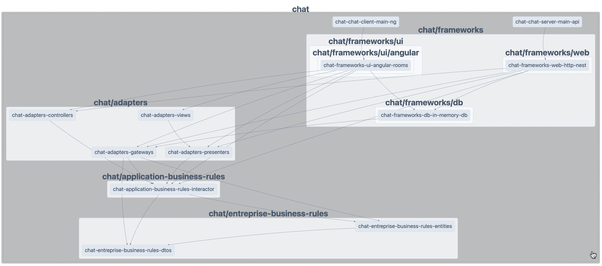
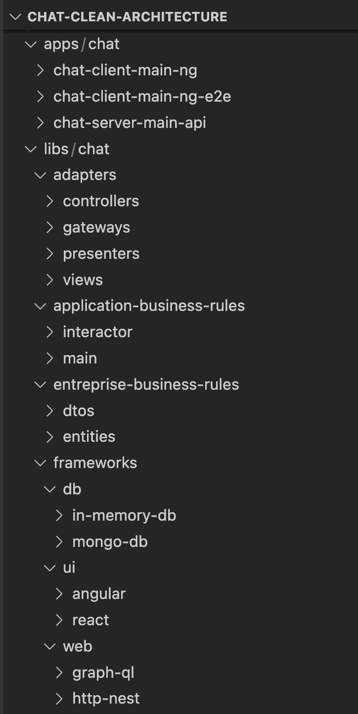

# Chat Clean Architecture

✨ **Example of a chat application using clean architecture** ✨

Discover the magic of clean architecture.

See: [The Clean Architecture](https://blog.cleancoder.com/uncle-bob/2012/08/13/the-clean-architecture.html)

 

## 1. Independent of Frameworks:

In this example, when using Angular or NestJs, we only utilize the necessary features such as Dependency Injection (DI), modules ... 
The frameworks/lib used as a tool.
## 2. Testable:

Starting with Test-Driven Development (TDD) will be easy, and our business rules can be tested without relying on the UI, database, web server, or any other external elements.

This example runs in two environments:

- In-memory: Used as an integration test for the full system and runs inside Angular (page: /chat/multi).
- Network: Uses HTTP and WebSocket, allowing the system's components to be easily split between client and server.

## 3. Independent of UI:

In this example, we use a native HTML/CSS view and another one using material-components. The UI can be easily changed without affecting the rest of the system. (Note: The API can also be seen as another kind of UI output.)

## 4. Independent of Database:

In this example, we use an in-memory database as a mock and MongoDB. However, you can easily swap it out for MySQL, Cassandra, Oracle, or any other database. Your business rules are not tightly coupled to the database.

## 5. Independent of any external agency:

In this example, all business rules are decoupled from the outside world. See the dependency graph [Dependencies Graph](#dependencies-graph)

# Ecosystem

### Languages: [Typescript]() , [Html]() , [Css]()
### Tools: [Nx workspace]()
### Frameworks/libs: [Angular]() , [NestJs]() , [Redis]() , [...React]() 
### Database: [In-memory]() , [...MongoDB]()  
### Network: [In-memory ]() , [HTTP]() , [WebSocket]() , [...GraphQL]() 
<br>
Note: In this example, we use different frameworks/libs to illustrate the power of this architecture and how easily we can replace them.
<br>
<br>

# Demo (in-memory Angular app as the main)

https://stackblitz.com/github/moez-sadok/chat-clean-architecture

# Installation
```
npm i
```

# Run locally
```
npm run start

npm run start:api
```

## Try with 2 versions

Version 1: Full in-memory angular app as main (no need to run the back-end api)

 - http://localhost:4200/chat/multi 

Version 2: With client/server (websockt/http), open in different private tabs

- http://localhost:4200/chat/user/1
- http://localhost:4200/chat/user/2

# dependencies graph
```
npm run dep-graph
```

 

<br>

# Code source structure

 

# Redis as adapter 
Many other tools harness the power of port/adapter architecture. For instance, Redis enables the creation and connection of a multi-chat server to support millions of connected users with just three lines of code.

See also: https://socket.io/docs/v4/redis-adapter/

https://docs.nestjs.com/websockets/adapter

To install Redis, please check the official Redis website and see also [NestJS WebSocket Adapter documentation](https://docs.nestjs.com/websockets/adapter).

- Uncomment redis adapter code inside the main.ts of chat-server-main-api 
```
  // const redisIoAdapter = new RedisIoAdapter(app);
  // await redisIoAdapter.connectToRedis();
  // app.useWebSocketAdapter(redisIoAdapter);
```
- Run redis server inside the cmd
```
redis-server
```

# Code scaffolding
Using Nx console vs code extension or cli:

Generate nest app:
```
npx nx generate @nrwl/nest:application chat/chat-server-main-api --frontendProject chat-chat-client-main-ng
```

Generate lib:
```
npx nx generate @nrwl/workspace:library chat/entreprise-business-rules/notifiyer
npx nx generate @nrwl/workspace:library chat/application-business-rules/network
npx nx generate @nrwl/workspace:library chat/adapters/network
```

# perf-testing
node tests/bench/send-message-bench-test.js
or
autocannon -c 10 -a 1000 -m POST http://localhost:3333/api/send-message --header 'Content-Type: application/json' --body '{ "roomId": "0", "userId": "1", "message": "perf message" }'
