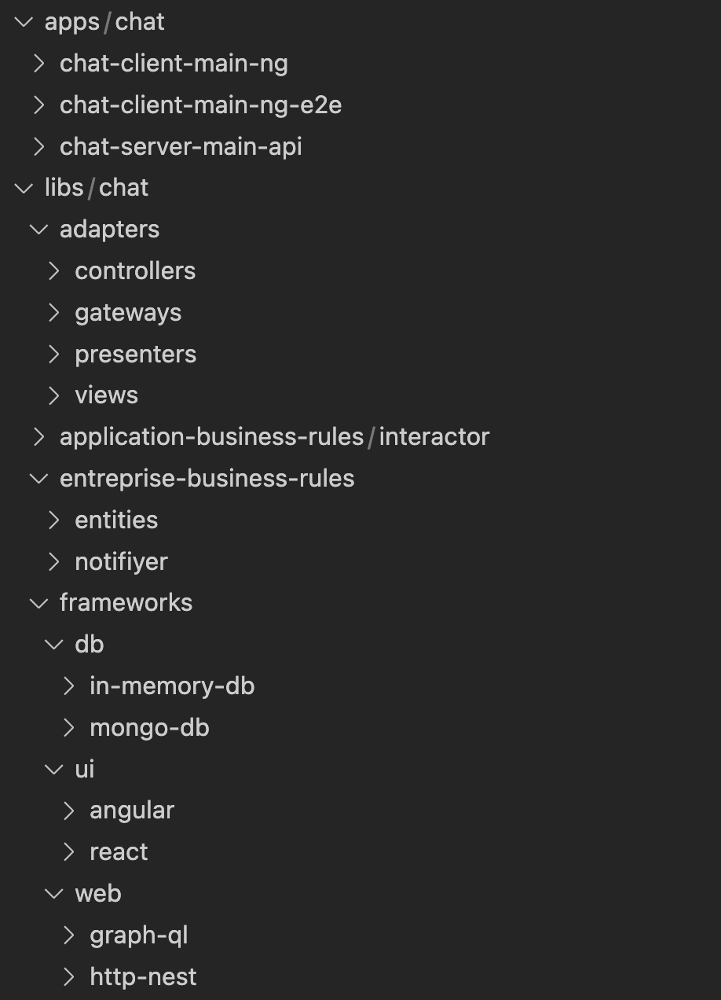
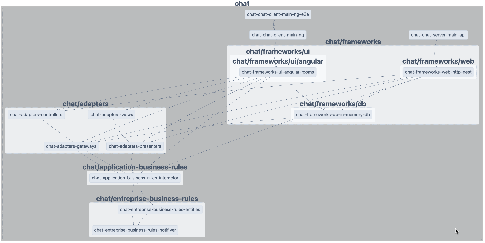

# PChat Technical Application Documentation

## Table of Contents <a id="main_tc"></a>

1. [Clean Architecture](#clean-architecture)

   - [1.1 Introduction](#introduction)
   - [1.2 Independent of Frameworks](#independent-of-frameworks)
   - [1.3 Testable](#testable)
   - [1.4 Independent of UI](#independent-of-ui)
   - [1.5 Independent of Database](#independent-of-database)
   - [1.6 Independent of External Agencies](#independent-of-external-agencies)

2. [Demo](#demo)
   - [2.1 Ecosystem](#ecosystem)
   - [2.2 Code Source Structure](#code-source-structure)
     - [a. Folder Structure](#code-folder-structure)
     - [b. Dependencies Graph](#dependencies-graph)
   - [2.3 Installation](#installation)
   - [2.4 Running Locally](#run-locally)
   - [2.5 Redis Adapter](#redis-as-adapter)
   - [2.6 Performance Testing](#perf-testing)
   - [2.7 Code Scaffolding](#code-scaffolding)

---

## 1. Clean Architecture <a id="clean-architecture"></a>

Discover the magic of clean architecture. This example application is a chat system on TypeScript.

See: [The Clean Architecture](https://blog.cleancoder.com/uncle-bob/2012/08/13/the-clean-architecture.html)


### 1.1 Introduction <a id="introduction"></a>

This application demonstrates how Clean Architecture separates concerns and makes the codebase more maintainable and testable.

### 1.2 Independent of Frameworks <a id="independent-of-frameworks"></a>

In this example, when using Angular or NestJs, we only utilize the necessary features such as Dependency Injection (DI), modules, etc. The frameworks/libs are used as tools.

### 1.3 Testable <a id="testable"></a>

Starting with Test-Driven Development (TDD) is easy. Business rules can be tested without relying on the UI, database, web server, or any external elements.

This example runs in two environments:

- In-memory: Used as an integration test for the full system and runs inside Angular (page: /chat/multi).
- Network: Uses HTTP and WebSocket, allowing easy separation between client and server components.

### 1.4 Independent of UI <a id="independent-of-ui"></a>

We use native HTML/CSS and material-components views. The UI can be changed without affecting business logic. (The API can also be seen as a type of UI output.)

### 1.5 Independent of Database <a id="independent-of-database"></a>

We use in-memory and MongoDB. You can easily switch to MySQL, Cassandra, Oracle, etc. Business rules are decoupled from the DB.

### 1.6 Independent of External Agencies <a id="independent-of-external-agencies"></a>

All business rules are decoupled from the outside world.  
See: [Dependencies Graph](#dependencies-graph)

---

## 2. Demo <a id="demo"></a>

### 2.1 Ecosystem <a id="ecosystem"></a>

**Languages**: [TypeScript](), [HTML](), [CSS]()  
**Tools**: [Nx workspace]()  
**Frameworks/libs**: [Angular](), [NestJS](), [Redis](), [React]()  
**Database**: [In-memory](), [MongoDB]()  
**Network**: [In-memory](), [HTTP](), [WebSocket](), [GraphQL]()

> Note: Different frameworks/libs are used to illustrate how easily they can be replaced.

---

### 2.2 Code Source Structure <a id="code-source-structure"></a>

#### 2.2.a Folder Structure <a id="folder-structure"></a>



---

#### 2.2.b Dependencies Graph <a id="dependencies-graph"></a>

```
npm run dep-graph
```

 

```bash
npm run dep-graph
```

### 2.3 Installation

```
npm i
```

### 2.4 Run locally

With client/server (websockt/http), open in different private tabs

```bash
npm run start:ui
npm run start:api
# Open 2 browser windows and try two users
# http://localhost:4200/chat/user/1
# http://localhost:4200/chat/user/2
```

Using bun:

 . Install bun globaly

 . add to package.json : "type": "module" 

 . update import on webpack.config.js 

 . npm run use:bun

> For bensh tests also update import autocanon


### 2.5 Redis as adapter

Many other tools harness the power of port/adapter architecture. For instance, Redis enables the creation and connection of a multi-chat server to support millions of connected users with just three lines of code.

See also: https://socket.io/docs/v4/redis-adapter/

https://docs.nestjs.com/websockets/adapter

To install Redis, please check the official Redis website and see also [NestJS WebSocket Adapter documentation](https://docs.nestjs.com/websockets/adapter).

- Uncomment redis adapter code inside the main.ts of chat-server-main-api

```bash
  // const redisIoAdapter = new RedisIoAdapter(app);
  // await redisIoAdapter.connectToRedis();
  // app.useWebSocketAdapter(redisIoAdapter);
```

- Run redis server inside the cmd

```
redis-server
```

- [2.6 Performance Testing](#perf-testing)
- [2.7 Code Scaffolding](#code-scaffolding)

### 2.6 Performance Testing

```bash
node tests/bench/send-message-bench-test.js
# or
autocannon -c 10 -a 1000 -m POST http://localhost:3333/api/send-message --header 'Content-Type: application/json' --body '{ "roomId": "0", "userId": "1", "message": "perf message" }'
```

### 2.7 Code Scaffolding

Using Nx console vs code extension or cli:

Generate nest app:

```bash
npx nx generate @nx/nest:application chat/chat-server-main-api --frontendProject chat-chat-client-main-ng
```

Generate lib:

```bash
npx nx generate @nx/workspace:library chat/entreprise-business-rules/notifiyer
npx nx generate @nx/workspace:library chat/application-business-rules/network
npx nx generate @nx/workspace:library chat/adapters/network
```

